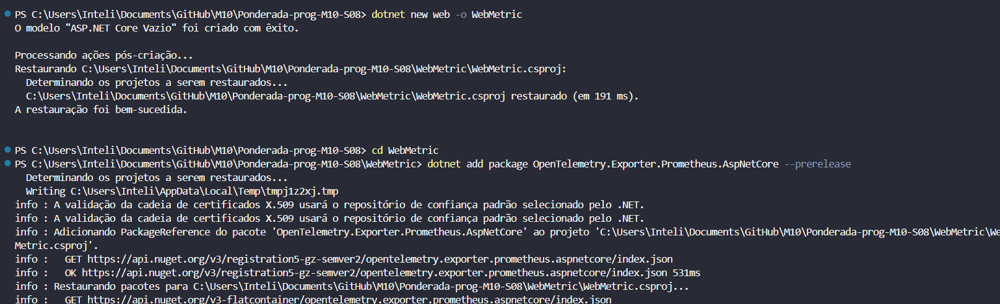
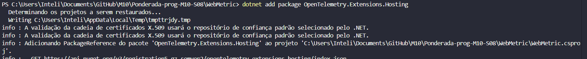
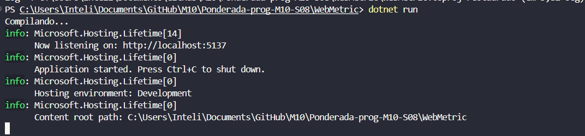
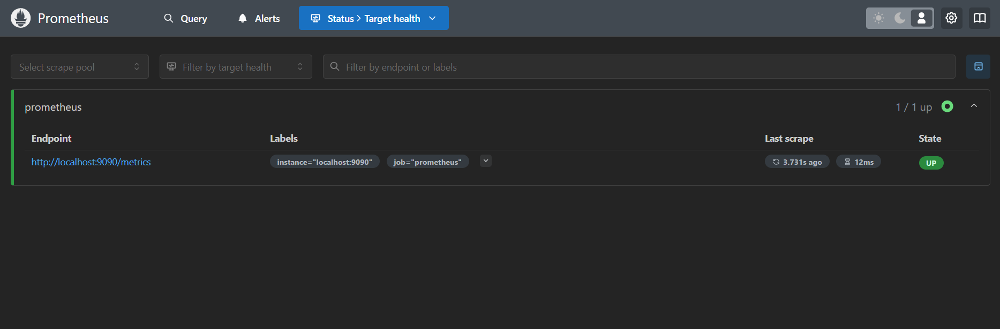
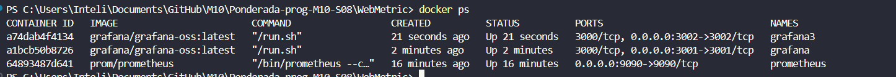

# Configurando Métricas com ASP.NET Core, OpenTelemetry e Prometheus

Este projeto implementa monitoramento de métricas em uma aplicação ASP.NET Core. As métricas são coletadas utilizando OpenTelemetry, expostas via Prometheus e visualizadas no Grafana. Abaixo estão os detalhes das configurações já realizadas.


## Requisitos

1. **.NET SDK** versão 8.0 ou superior.
2. **Docker** para execução de Prometheus e Grafana.
3. **Editor de código**, como Visual Studio Code.


## Passo a Passo

### 1. Criar um Projeto ASP.NET Core

1. Abra o terminal e crie um novo projeto vazio:
   ```bash
   dotnet new web -o WebMetric
   ```
2. Navegue até a pasta do projeto:
   ```bash
   cd WebMetric
   ```


### 2. Adicionar Pacotes Necessários

1. Adicione o pacote para exportação de métricas para Prometheus:
   ```bash
   dotnet add package OpenTelemetry.Exporter.Prometheus.AspNetCore --prerelease
   ```
2. Adicione o pacote de suporte ao hosting OpenTelemetry:
   ```bash
   dotnet add package OpenTelemetry.Extensions.Hosting
   ```



### 3. Configurar o Aplicativo para Métricas

1. No arquivo `Program.cs`, adicione as configurações para registrar as métricas:
   ```csharp
   using OpenTelemetry.Metrics;
   using OpenTelemetry.Resources;

   var builder = WebApplication.CreateBuilder(args);

   builder.Services.AddOpenTelemetry()
       .WithMetrics(builder =>
       {
           builder
               .SetResourceBuilder(ResourceBuilder.CreateDefault().AddService("WebMetric"))
               .AddAspNetCoreInstrumentation()
               .AddPrometheusExporter();
       });

   var app = builder.Build();

   app.MapGet("/", () => "Hello, Metrics!");
   app.UseOpenTelemetryPrometheusScrapingEndpoint();

   app.Run();
   ```



### 4. Executar o Aplicativo

1. Compile e execute o projeto:
   ```bash
   dotnet run
   ```
2. Verifique a URL padrão no terminal para o endpoint Prometheus (`http://localhost:9090/metrics`).



## Configurar o Ambiente de Monitoramento

### 1. Configurar o Prometheus

1. Crie um arquivo `Prometheus.yml` no diretório do projeto com o seguinte conteúdo:
   ```yaml
   global:
     scrape_interval: 15s

   scrape_configs:
     - job_name: 'aspnetcore'
       metrics_path: '/metrics'
       static_configs:
         - targets: ['host.docker.internal:5137']
   ```
2. Execute o container Docker do Prometheus:
   ```bash
   docker run -d --name prometheus -p 9090:9090 -v "$(pwd)/Prometheus.yml:/etc/prometheus/prometheus.yml" prom/prometheus
   ```

### 2. Configurar o Grafana

1. Execute o container Docker do Grafana:
   ```bash
   docker run -d -p 3000:3000 --name grafana grafana/grafana-oss:latest
   ```
2. Acesse o Grafana em `http://localhost:3000`.



## Conclusão 

A implementação deste projeto demonstra como integrar OpenTelemetry, Prometheus e Grafana para monitorar métricas de uma aplicação ASP.NET Core. Com esta configuração, é possível coletar, expor e visualizar métricas em tempo real, permitindo o monitoramento eficiente do desempenho da aplicação.

A utilização dessas ferramentas cria uma solução escalável e extensível para identificar gargalos e otimizar processos com base em dados concretos. A configuração bem-sucedida do pipeline de métricas estabelece uma base sólida para futuras melhorias, como a inclusão de métricas personalizadas e a automação de alertas. Com isso, a equipe pode tomar decisões informadas para garantir a saúde e a performance da aplicação em ambientes de produção.